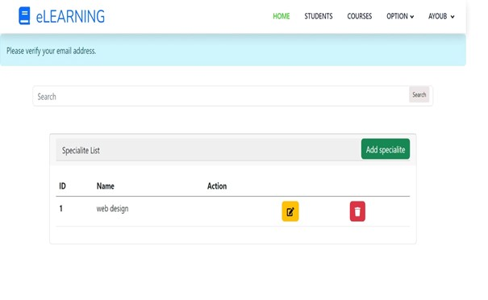

# Project Title

## Important Notice

This repository is protected. You are not allowed to download, use, or distribute the code in this repository without explicit permission from the repository owner. Please contact me at ayoublandolsie@gmail.com if you wish to use or contribute to this project.

## Project Images

Below are some screenshots of the application:
## Project Images

Below are some screenshots of the application:

  
  
  
  

  
  
  
  

  
  
  
  

  
  
  
  

  
  
  
  

  
  
  
  

## Description

This project is a comprehensive platform for managing educational content and user accounts. It provides functionalities for both users and administrators to efficiently manage and participate in training programs, courses, and certifications.

## Features

### For Users
- **Create an Account**: Users can create an account to access the platform.
- **Authenticate**: Users can log in to their accounts.
- **Participate in Training**: Users can enroll in training programs.
- **Follow a Course**: Users can follow and complete courses.
- **Take Tests**: Users can take tests related to their courses.
- **Obtain Certificates**: Users can receive certificates upon course completion.
- **Manage Account**: Users can manage their personal account information.

### For Administrators
- **Manage User Accounts**: Administrators can manage user accounts, including activation and deactivation.
- **Search Accounts**: Administrators can search for user accounts.
- **Search Courses**: Administrators can search for courses.
- **Search Groups**: Administrators can search for groups.
- **Manage Tests**: Administrators can manage tests within the platform.
- **Manage Modules (Training)**: Administrators can manage training modules.
- **Manage Certificates**: Administrators can manage certificates issued to users.
- **Manage Groups**: Administrators can manage user groups.
- **Manage Courses**: Administrators can manage course content and enrollment.
- **Confirm Module Enrollment**: Administrators can confirm requests from learners to enroll in training modules.
- **Add Learners to Groups**: Administrators can add learners to specific groups.
- **Add Tutors to Groups**: Administrators can add tutors to specific groups.
- **Add Courses to Modules**: Administrators can add courses to training modules.
- **Add Lessons to Courses**: Administrators can add lessons to courses.
- **Add Modules to Groups**: Administrators can add training modules to groups.

## Tech Stack

- **Backend and Frontend**: Laravel, MySQL
- **Image Handling**: Laravel Storage, Cloudinary (optional)
- **Email Service**: Mailgun/SMTP
- **Build Tool**: Vite.js

## About Laravel

Laravel is a web application framework with expressive, elegant syntax. We believe development must be an enjoyable and creative experience to be truly fulfilling. Laravel takes the pain out of development by easing common tasks used in many web projects, such as:

- [Simple, fast routing engine](https://laravel.com/docs/routing).
- [Powerful dependency injection container](https://laravel.com/docs/container).
- Multiple back-ends for [session](https://laravel.com/docs/session) and [cache](https://laravel.com/docs/cache) storage.
- Expressive, intuitive [database ORM](https://laravel.com/docs/eloquent).
- Database agnostic [schema migrations](https://laravel.com/docs/migrations).
- [Robust background job processing](https://laravel.com/docs/queues).
- [Real-time event broadcasting](https://laravel.com/docs/broadcasting).

Laravel is accessible, powerful, and provides tools required for large, robust applications.

## Learning Laravel

Laravel has the most extensive and thorough [documentation](https://laravel.com/docs) and video tutorial library of all modern web application frameworks, making it a breeze to get started with the framework.

You may also try the [Laravel Bootcamp](https://bootcamp.laravel.com), where you will be guided through building a modern Laravel application from scratch.

If you don't feel like reading, [Laracasts](https://laracasts.com) can help. Laracasts contains over 2000 video tutorials on a range of topics including Laravel, modern PHP, unit testing, and JavaScript. Boost your skills by digging into our comprehensive video library.

## Laravel Sponsors

We would like to extend our thanks to the following sponsors for funding Laravel development. If you are interested in becoming a sponsor, please visit the Laravel [Patreon page](https://patreon.com/taylorotwell).

### Premium Partners

- **[Vehikl](https://vehikl.com/)**
- **[Tighten Co.](https://tighten.co)**
- **[Kirschbaum Development Group](https://kirschbaumdevelopment.com)**
- **[64 Robots](https://64robots.com)**
- **[Cubet Techno Labs](https://cubettech.com)**
- **[Cyber-Duck](https://cyber-duck.co.uk)**
- **[Many](https://www.many.co.uk)**
- **[Webdock, Fast VPS Hosting](https://www.webdock.io/en)**
- **[DevSquad](https://devsquad.com)**
- **[Curotec](https://www.curotec.com/services/technologies/laravel/)**
- **[OP.GG](https://op.gg)**
- **[WebReinvent](https://webreinvent.com/?utm_source=laravel&utm_medium=github&utm_campaign=patreon-sponsors)**
- **[Lendio](https://lendio.com)**

## Contributing

Thank you for considering contributing to the Laravel framework! The contribution guide can be found in the [Laravel documentation](https://laravel.com/docs/contributions).

## Code of Conduct

In order to ensure that the Laravel community is welcoming to all, please review and abide by the [Code of Conduct](https://laravel.com/docs/contributions#code-of-conduct).

## Security Vulnerabilities

If you discover a security vulnerability within Laravel, please send an e-mail to Taylor Otwell via [taylor@laravel.com](mailto:taylor@laravel.com). All security vulnerabilities will be promptly addressed.

## License

The Laravel framework is open-sourced software licensed under the [MIT license](https://opensource.org/licenses/MIT).
